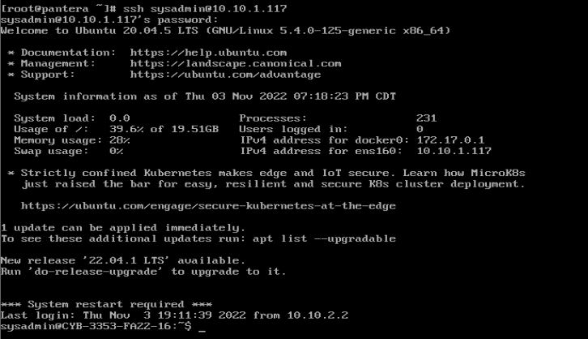

# alechoward76.github.io

Step 1: Arch Linux Installation & Launch
  - Acquire an installation image and verify its signature
  - Open the download in VMware
  - In the launch settings, select Other Linux 5.x Kernel 64-bit as the OS
  - Allocate 2GB of RAM and 20GB of HDD space 
  - After creating the VM, edit the .vmx file and insert: firmware="efi" as the second line of the file
  - Now we are able to run the virtual machine

Step 2: Partitioning the Disk
  - List the disk using the command: fdisk -l
  - My disk was assigned to /dev/sda , so I used this command to begin partitioning: gdisk /dev/sda
  - I made three partitions: sda1 for the EFI system partition, sda2 for Linux swap, and sda3 for root. All of these used sizes recomended for partition tables.
 
 Step 3: Formatting Partitions: 
  - In order to format the EFI system partition, I used this command: mkfs.fat -F32 /dev/sda1
  - To format the swap partition, I used this command: mkswap /dev/sda2
  - Finally, to format the root partition, this command was used: mkfs.ext4 /dev/sda3

Step 4: Mounting the File Systems
  - Command for mounting EFI system partition: mount /dev/sda3 /mnt
  - Command for mounting swap partition: swapon /dev/swap_partition
  - Creating mount point: mkdir /mnt/efi
  - Command for mounting root partition: mount /dev/root_partition /mnt

Step 5: Installing Essential Packages
  - Verified the mirror servers using: cat /etc/pacman.d/mirrorlist
  - Had to update keyring before I could begin installing packages: pacman -Sy archlinux-keyring
  - Command used to install essential packages: pacstrap /mnt base linux linux-firmware nano openssh sudo
  
Step 6: Configure the System
  - Command used to create file system: genfstab -U /mnt >> /mnt/etc/fstab
  - Command used to change root into new system: arch-chroot /mnt 
  - Next step is to configure timezone
  - Command used to set timezone: ln -sf /usr/share/zoneinfo/America/Chicago /etc/localtime
  - Command to create /etc/adjtime: hwclock --systohc
  - Up next is configuring localization
  - I then uncommented the en_US.UTF-8 line in the locale.gen file and ran the following command to generate locales: locale-gen
  - I then created a configuration file for locale and set a LANG variable to en_US.UTF-8 inside of it
  - Configuring network is next
  - I created a hostname file inide of the etc directory and edited it to contain the hostname: pantera, after the popular groove-metal band
  - To recreate the inframs image, I ran the following command: mkinitcpio -P , and then I changed root's password (to "a")

Step 7: Setup Boot Loader
  - First, I had to install the grub and efibootmgr packages.
  - I used the following command to install GRUB into my mount point: grub-install --target=x86_64-efi --efi-directory=/efi --bootloader-id=GRUB
  - Command used to create config file: grub-mkconfig -o /boot/grub/grub.cfg

Step 7.5: Fix Network
  - I forgot to install network tools, so I installed the netctl, dhcpcd and dhcp packages
  - I then edited the hosts file in the etc to include info for localhosts and my hostname
  - I used : ip link to find my wireless adapter name which was: ens33
  - I ran the following command to generate a network card: cp /etc/netctl/examples/ethernet-static /etc/netctl/ens33
  - I then edited the file to assign ens33 as the interface
  - Finally, I enabled my changes using the 2 following commands

Step 8: Post-Installation
  - I umounted and rebooted successfully, after doing this, I created a new user named alec, and set its password to Mountain1!
  - I then edited the visudo file using this command: EDITOR=nano visudo , to give alec sudo permissions by adding the following line: alec ALL=(ALL) ALL
  - I chose to install fish as my second shell, as from what I could find online, it is more user-friendly. Since I am unfamiliar with fish, I decided to only configure it as an interactive shell.
  - I then edited the .bashrc file to contain "exec fish"
  - I had already installed ssh and was able to ssh into my VM: 

