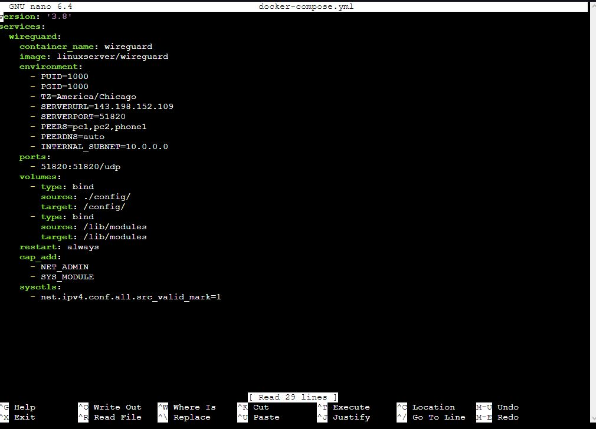
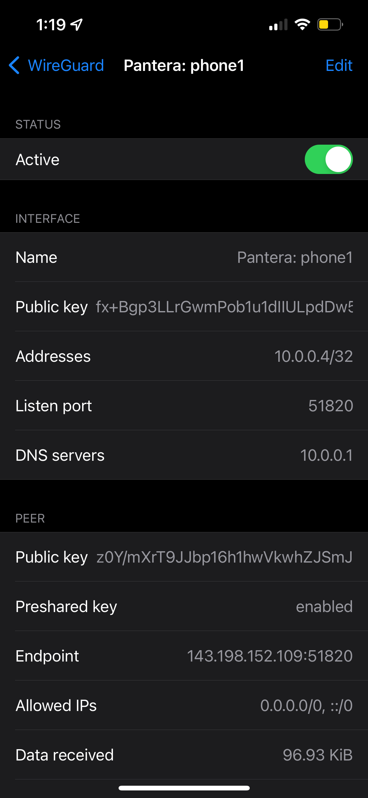
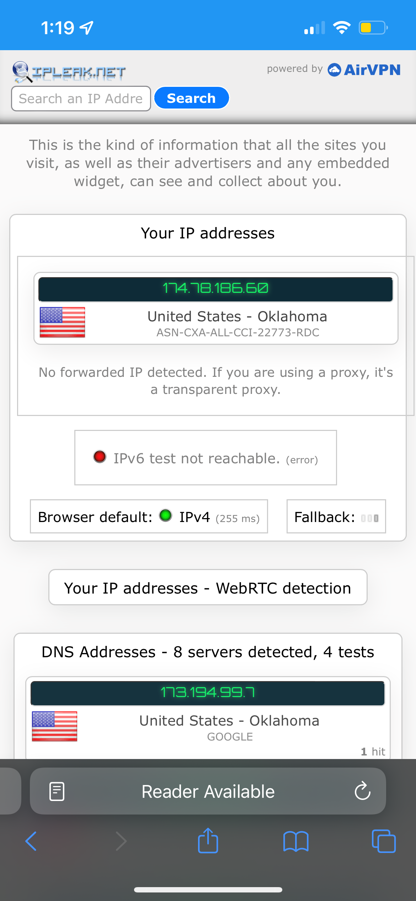
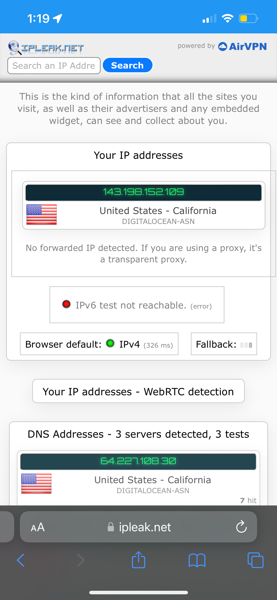
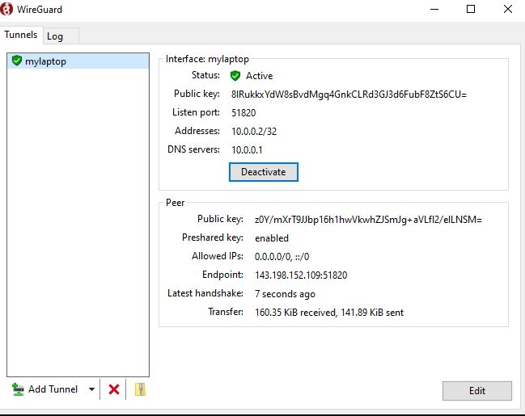
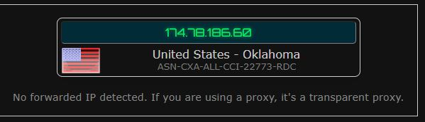
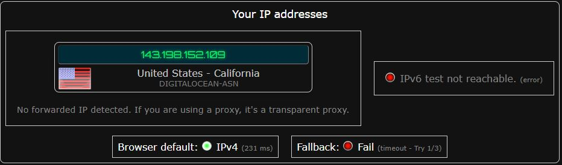

Step 1: Install Docker on Droplet
  - I followed this guide to set up docker on my droplet: https://thematrix.dev/install-docker-and-docker-compose-on-ubuntu-20-04/
  - I ran this command to install the tools needed: sudo apt install apt-transport-https ca-certificates curl software-properties-common -y
  - I then ran this command to add a docker key: curl -fsSL https://download.docker.com/linux/ubuntu/gpg | sudo apt-key add -
  - I ran this command to add the Docker repo for 32 / 64 bit OS: sudo add-apt-repository \
   "deb [arch=amd64] https://download.docker.com/linux/ubuntu \
   $(lsb_release -cs) \
   stable"
   - I switched to the above repo using this: apt-cache policy docker-ce
   - I installed Docker: sudo apt install docker-ce -y
   - Then I installed Docker Compose: sudo curl -L "https://github.com/docker/compose/releases/download/1.27.4/docker-compose-$(uname -s)-$(uname -m)" -o     /usr/local/bin/docker-compose
   - Finally, I just had to set proper execute permissions: sudo chmod +x /usr/local/bin/docker-compose

Step 2: Install Wireguard on Droplet
   - I created directories in the following path: ~/wireguard/config/
   - Then, I created a docker-compose.yml file and edited it as seen below in this path: ~/wireguard/docker-compose.yml
   
   - I navigated to the wireguard directory and used this command to start wireguard: docker-compose up -d
   - I ran this command to generate a qr code to open a tunnel for my phone: docker-compose logs -f wireguard
   
  
  IP Without VPN: 
   
   
   IP With VPN:
   
   
   - I copied the config file for pc1 and used it to open a tunnel on my  laptop for wireguard for Windows
  
  
  IP Without VPN: 
   
   
   IP With VPN:
   
